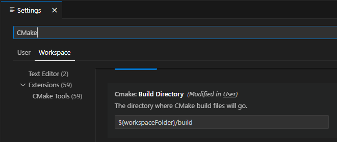

Developer Setup
===============

Required Tools
--------------

- Compiler

  - Windows

    - `Microsoft Visual Studio 2022 <https://visualstudio.microsoft.com/downloads/>`_

  - Linux

    - GCC/G++ >= 11
    - Ninja (ninja-build) recommended

  - macOS

    - llvm >= 18 (llvm@18 via homebrew recommended)
    - Ninja (ninja via homebrew recommended)

- `CMake >= 3.24 <https://cmake.org/download/>`_
- `Git <https://git-scm.com/download/win>`_
- `Python >= 3.10 <https://www.python.org/downloads/windows/>`_
- `Qt 6.8.3 <https://www.qt.io/download-open-source>`_

  - For Microsoft Visual Studio >= 2022, install Qt for **MSVC 2022 64-bit**
  - For Linux GCC, install Qt for **Desktop gcc 64-bit**
  - For macOS, install Qt for - For macOS, install Qt for **Desktop**
  - Additional libraries

    - Qt Image Formats
    - Qt Multimedia
    - Qt Positioning
    - Qt Serial Port

    .. image:: images/developer-setup-01-qt-install-small.png

  - See setup-* scripts for current version
  - Add the ``bin`` directory to your system ``PATH`` variable (e.g., ``C:\Qt\6.8.3\msvc2022_64\bin``)
  - Alternate install via aqtinstall (installs to a versioned subdirectory
    within the current directory)

    .. code:: bash

      $ python3 pip install --upgrade aqtinstall
      $ aqt install-qt windows desktop 6.8.3 win64_msvc2022_64 -m qtimageformats qtmultimedia qtpositioning qtserialport
      $ aqt install-qt linux desktop 6.8.3 linux_gcc_64 -m qtimageformats qtmultimedia qtpositioning qtserialport
      $ aqt install-qt mac desktop 6.8.3 clang_64 -m qtimageformats qtmultimedia qtpositioning qtserialport

    - See https://ddalcino.github.io/aqt-list-server/ for additional configurations

.. note:: Qt versions maintain a level of compatibility between patch releases
          of the same major and minor versions (e.g., 6.9.0 through 6.9.3). No
          issues are expected moving between patch releases. Breaking changes
          may sometimes be introduced in minor releases (e.g., 6.9 to 6.10). As
          new releases become available, older releases should remain available
          via the Archive selection filter in the Qt Maintenance Tool or via
          aqtinstall.

Recommended Tools
-----------------

Integrated Development Environment
^^^^^^^^^^^^^^^^^^^^^^^^^^^^^^^^^^

An IDE is strongly recommended to develop Supercell Wx. `Microsoft Visual Studio
<https://visualstudio.microsoft.com/downloads/>`_ is a good option on Windows,
and `Visual Studio Code <https://code.visualstudio.com/>`_ is a good
cross-platform option.

For Visual Studio Code, it is recommended to install the following extensions:

- `C/C++ Extension Pack <https://marketplace.visualstudio.com/items?itemName=ms-vscode.cpptools-extension-pack>`_
- `clangd <https://marketplace.visualstudio.com/items?itemName=llvm-vs-code-extensions.vscode-clangd>`_
- `CMake <https://marketplace.visualstudio.com/items?itemName=twxs.cmake>`_
- `CMake Tools <https://marketplace.visualstudio.com/items?itemName=ms-vscode.cmake-tools>`_
- `Python <https://marketplace.visualstudio.com/items?itemName=ms-python.python>`_
- `reStructuredText <https://marketplace.visualstudio.com/items?itemName=lextudio.restructuredtext>`_
- `reStructuredText Syntax highlighting <https://marketplace.visualstudio.com/items?itemName=trond-snekvik.simple-rst>`_
- `SQLite Viewer <https://marketplace.visualstudio.com/items?itemName=qwtel.sqlite-viewer>`_

For remote development (e.g., Linux development on a Windows host), it is also
recommended to install the following:

- `Remote Development <https://marketplace.visualstudio.com/items?itemName=ms-vscode-remote.vscode-remote-extensionpack>`_

For UI development, it is recommended to run Qt Creator, installable via the Qt
Maintenance Tool or aqtinstall. Alternatively, Qt Designer may be used as a
lighter weight option.

.. note:: Qt Creator has had issues building the Supercell Wx project, with
          infinite recursion during CMake and Conan configuration, and is
          therefore only recommended for UI development. These issues may have
          since been resolved, but your mileage may vary.

Other IDEs are likely to work as well:

- `Code::Blocks <https://www.codeblocks.org/>`_
- `CLion <https://www.jetbrains.com/clion/>`_
- `Eclipse IDE for C/C++ Developers <https://www.eclipse.org/downloads/packages/installer>`_

Git Tools
^^^^^^^^^

A visual tool for navigating the Git repository and submodules can be helpful,
but is not required for development.

- `GitKraken <https://www.gitkraken.com/>`_
- `GitLens <https://marketplace.visualstudio.com/items?itemName=eamodio.gitlens>`_
- `Sourcetree <https://www.sourcetreeapp.com/>`_

Initial Configuration
---------------------

After cloning the repository from `GitHub <https://github.com/dpaulat/supercell-wx>`_, initialize all submodules:

.. code:: bash

  $ git submodule update --init --recursive

You are now ready to configure your environment. You can use either CMakePresets
or pre-generate your build directory (CMake Setup). The choice comes down to
personal preference, but the CMake Setup scripts tend to be easier using
Microsoft tools (Visual Studio, Visual Studio Code) on Windows, while other
tools and platforms benefit from CMakePresets.

If your environment requires any special setup, such as an alternate compiler
configuration, you may configure settings in ``tools/lib/user-setup.sh`` (see
``tools/lib/user-setup.example.sh``).

CMake Presets
^^^^^^^^^^^^^

Run the ``tools/configure-environment.{ext}`` script.

.. code:: text

  Usage:
    configure-environment.bat [VENV_PATH]
    configure-environment.sh  [VENV_PATH]

    The configure environment script will setup your Python virtual environment,
    install Python requirements and install Conan profiles.

    The VENV_PATH argument will specify the Python virtual environment path to
    use. It defaults to "supercell-wx/.venv/". If you wish to run without a
    virtual environment, specify "none".

Open ``CMakeLists.txt`` in your favorite editor, select your desired CMake
Preset, and build the ``supercell-wx`` target.

.. note::

  Visual Studio generates its own additional targets. Ensure the Visual Studio
  configuration matches the preset selected.

.. note::

  Visual Studio Code on Windows requires running from the *x64 Native Tools
  Command Prompt for VS 2022*, or updating your shortcut target (e.g.,
  ``%comspec% /k ""C:\Program Files\Microsoft Visual Studio\2022\Community\VC\Auxiliary\Build\vcvars64.bat" ^&^& "C:\Users\username\AppData\Local\Programs\Microsoft VS Code\Code.exe""``)

CMake Setup
^^^^^^^^^^^

Run the ``tools/setup-{config}.{ext}`` script.

.. code:: text

  Usage:
    setup-{config}.bat [BUILD_DIR] [VENV_PATH]
    setup-{config}.sh  [BUILD_DIR] [CONAN_PROFILE] [VENV_PATH] [ASAN_ENABLE]

    The setup script will setup your Python virtual environment, install Python
    requirements, install Conan profiles and dependencies, and run CMake
    configure.

    The setup script assumes that Qt has been installed to a default directory
    ("C:\Qt" on Windows, or "/opt/Qt" on Linux). If a custom directory has been
    used, the script will need modified to reflect the custom installation base.

    The BUILD_DIR argument will specify the CMake build directory to use. You
    may specify a relative or absolute path. It defaults to
    "supercell-wx/build-{config}/".

    The CONAN_PROFILE argument will specify the Conan Profile to use. Please
    select a Conan profile present in "tools/conan/profiles/", appropriate for
    your compiler and architecture. This argument is only applicable for Linux
    systems.

    The VENV_PATH argument will specify the Python virtual environment path to
    use. You may specify a relative or absolute path. It defaults to
    "supercell-wx/.venv/". If you wish to run without a virtual environment,
    specify "none".

    The ASAN_ENABLE argument will specify whether or not to enable or disable
    the address sanitizer. A default value of "disabled" will disable the
    sanitizer, while any other value will enable it.

Depending on the generator, either:

- Open your solution or project files in the build directory (e.g., ``supercell-wx.sln``), or
- Open the source directory, pointing your editor to the proper build directory

You are ready to build the ``supercell-wx`` target.

Visual Studio Code
""""""""""""""""""

Open the supercell-wx source directory in Visual Studio Code. Open the Settings
Window, and filter on CMake. In Workspace settings, set your Build Directory to
your desired destination.

On the Primary Side Bar (left), select the CMake icon. Under Build, select the
appropriate Kit (compiler), and set your target to supercell-wx. You can proceed
to build supercell-wx using the ``Build`` button on the left side of the Status
Bar.

Troubleshooting
^^^^^^^^^^^^^^^

Missing Packages (Linux)
""""""""""""""""""""""""

When configuring on Linux, you may encounter an error due to missing packages
from your system. These may be installed manually, or you may update your conan
global configuration (``~/.conan2/global.conf``):

.. code::

    tools.system.package_manager:mode = install
    tools.system.package_manager:sudo = True

After installing missing packages, re-run the setup script.

Compiler or Qt Version Issues
"""""""""""""""""""""""""""""

After updating compiler or Qt versions, you may need to update paths in your
CMake cache. This may be done via your IDE, rerunning setup scripts, or by
manually editing ``CMakeCache.txt`` located in your build directory.

Guidelines
----------

It is expected that developers will follow these guidelines. On occasion, there
will be use cases for deviation from the guidelines below.

- Don't break existing functionality
- Follow C++ best practices
- Format files after making changes (most IDEs will respect the .clang-format
  file at the root of the repository)
- Follow the `Google C++ Style Guide <https://google.github.io/styleguide/cppguide.html>`_
- Keep Qt-dependent code in the ``scwx-qt`` project
- If adding a dependency, prefer adding it to conanfile.py over adding a
  submodule, unless additional customization is necessary
- Minimize custom development environment configuration
- Update acknowledgements when appropriate

  - Supercell Wx should remain MIT-licensed
  - Dependencies must be compatible with the MIT license

    - LGPL-licensed software must be contained within shared libraries
    - GPL-licensed software must not be used

Help
----

Stuck? You can look at https://github.com/dpaulat/supercell-wx/blob/develop/.github/workflows/ci.yml
for hints, or join the Discord server for help.
