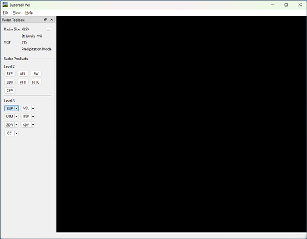
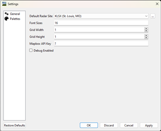
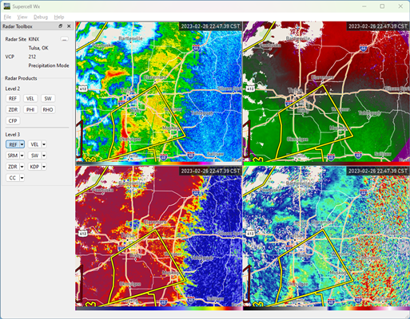
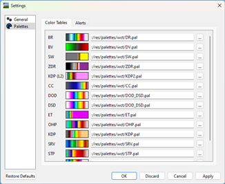
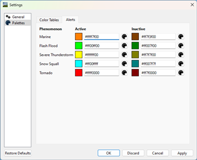

Initial Setup
=============

Installation
------------

Supercell Wx can be downloaded from GitHub. Download the latest release from
https://github.com/dpaulat/supercell-wx/releases.

Once downloaded, unzip the application to its own folder, and launch
supercell-wx.exe from the bin folder. No installation is required, and all
dependencies are self-contained.

.. note:: Installation of the Microsoft Visual C++ Redistributable may be
          required, provided in the bin folder (vc_redist.x64.exe).

Configuration
-------------

The first time the application is launched, a black screen will appear in place
of the map.

Using the menu, navigate to the Settings window using **File > Settings**.

Here, a Mapbox API key must be configured. An account can be created at
https://www.mapbox.com/. After reviewing terms of service, create an API key (or
public token) with default scopes.

.. note:: Future releases will add alternative map sources, as well as a basic
          map when no map source is configured.

Additional options can be configured in the Settings dialog as desired. Once
complete, press **OK** and restart the application.

.. note:: Most settings changes require a restart of the application to take
          effect. Future releases will improve this behavior.

Now that the application has been configured, it is ready for use.

Map Controls
------------

Supercell Wx uses `MapLibre GL Native
<https://github.com/maplibre/maplibre-gl-native>`_ to render a responsive map.
To pan the map, click and drag the mouse. Use the mouse wheel to zoom, or double
click using the left or right mouse button to zoom in or out respectively.
Pressing ``s`` will cycle through map styles, including light, dark and
satellite underlays.

Customization
-------------

The map and radar display have multiple customization options, including color
tables. The default color tables come from `NOAA's Weather and Climate Toolkit
<https://www.ncdc.noaa.gov/wct/index.php>`_, but can be modified from the
**Palettes** category in the **Settings** dialog. Color tables are compatible
with the `GRLevelX <http://www.grlevelx.com/>`_ `Color Table File Specification
<http://www.grlevelx.com/manuals/color_tables/files_color_table.htm>`_.

Additional color tables can be found at a number of sites, including:

- https://grlevelxusers.com/grlevelx-goodies/categories/color-tables/
- https://www.wxtools.org/

In addition to color tables, alert colors can also be modified. Use the text box
to specify a color in ARGB hexadecimal format (#aarrggbb), or use the color
picker to select a color.

