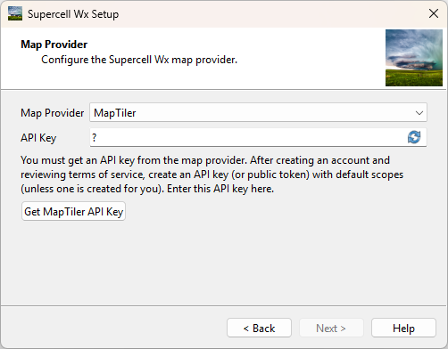

Initial Setup
=============

Installation
------------

Supercell Wx can be downloaded from GitHub. Download the latest release from
https://github.com/dpaulat/supercell-wx/releases.

Windows Setup
^^^^^^^^^^^^^

*Minimum requirements: Windows 10 (1809 or later), Windows 11*

Once downloaded, unzip the application to its own folder, and launch
supercell-wx.exe from the bin folder. No installation is required, and all
dependencies are self-contained.

.. note:: Installation of the Microsoft Visual C++ Redistributable may be
          required, provided in the bin folder (vc_redist.x64.exe).

Linux Setup
^^^^^^^^^^^

*Minimum requirements: Linux/X11 with support for GCC 11 and OpenGL (e.g.,
Fedora 34+, Ubuntu 22.04+, EndeavourOS, openSUSE Tumbleweed)*

AppImage
""""""""

The Linux AppImage is the preferred way to run Supercell Wx on Linux. It
packages most required dependencies in order to run on a large number of modern
Linux distributions without additional setup requirements.

To run the AppImage, download the appropriate file with the .AppImage extension,
add executable permissions, and double-click the application or launch it from
the command line.

Binary Release (tar.gz)
"""""""""""""""""""""""

Supercell Wx uses Qt for its interface. The Qt libraries that Supercell Wx
depend on are included in each release, but the Qt libraries may have
`additional dependencies <https://doc.qt.io/qt-6/linux-requirements.html>`_
that require manual installation.

In Fedora and Ubuntu, in addition to standard X11/XCB libraries, xcb-cursor must
be installed. In openSUSE, a certificate workaround must be installed.

.. code:: bash

  > dnf install xcb-util-cursor                # e.g., Fedora
  > apt install libxcb-cursor0                 # e.g., Ubuntu
  > zypper install ca-certificates-steamtricks # e.g., openSUSE

Once downloaded, untar the application to its own folder, and launch
supercell-wx from the bin folder.

Setup Wizard
------------

The first time the application is launched, a setup wizard will appear. Follow
the instructions displayed on the screen to configure the application for first
use.

The Map Provider page displays first. Here, a map API key must be configured,
using either `MapTiler <https://www.maptiler.com/>`_ or `Mapbox
<https://www.mapbox.com/>`_ (specify the desired map provider). After creating
an account and reviewing terms of service, create an API key (or public token)
with default scopes (unless one is created for you).

.. note:: Both MapTiler and Mapbox offer free tiers. At the time of writing,
          Mapbox requires a credit card for sign-up, while MapTiler does not.

.. note:: Future releases will add a basic map when no map source is configured.

Next, the Map Layout page displays. Here, the default display of a single map
can be changed. The Map Layout can be configured as large as a 2x2 grid.

.. image:: images/initial-setup-07-wizard-map-layout.png

Configuration
-------------

If no map API key has been entered, a black screen will appear in place of the
map. An API key can be reconfigured in settings, following the API key
instructions above.

.. image:: images/initial-setup-01-initial-startup-small.png

Using the menu, navigate to the Settings window using **File > Settings**.

.. image:: images/initial-setup-02-initial-settings-small.png

Additional options can be configured in the Settings dialog as desired. Once
complete, press **OK** and restart the application.

.. note:: Most settings changes require a restart of the application to take
          effect. Future releases will improve this behavior.

Now that the application has been configured, it is ready for use.

.. image:: images/initial-setup-03-initial-configured-small.png

Map Controls
------------

Supercell Wx uses `MapLibre Native Qt
<https://github.com/maplibre/maplibre-native-qt>`_ to render a responsive map.

To pan the map, left-click and drag the mouse. To rotate the map, right-click
and drag the mouse. To reset the rotation to a north-up orientation, left-click
the compass icon in the upper right corner of the map. Use the mouse wheel to
zoom, or double click using the left or right mouse button to zoom in or out
respectively. Pressing ``s`` or both left and right mouse buttons will cycle
through map styles, including light, dark and satellite underlays.

For more information about the displayed radar product, hover over the time in
the upper right of the map. Hold the ``SHIFT`` key to view radar moment data or
other derived information underneath the cursor.

Customization
-------------

The map and radar display have multiple customization options, including color
tables. The default color tables come from `NOAA's Weather and Climate Toolkit
<https://www.ncdc.noaa.gov/wct/index.php>`_, but can be modified from the
**Palettes** category in the **Settings** dialog. Color tables are compatible
with the `GRLevelX <http://www.grlevelx.com/>`_ `Color Table File Specification
<http://www.grlevelx.com/manuals/color_tables/files_color_table.htm>`_.

.. image:: images/initial-setup-04-settings-color-tables-small.png

Additional color tables can be found at a number of sites, including:

- https://grlevelxusers.com/grlevelx-goodies/categories/color-tables/
- https://grx.almanydesigns.com/downloads/ (Color Table Format V3.0+ is not supported)
- https://www.wxtools.org/

In addition to color tables, alert colors can also be modified. Use the text box
to specify a color in ARGB hexadecimal format (#aarrggbb), or use the color
picker to select a color.

.. image:: images/initial-setup-05-settings-alerts-small.png
