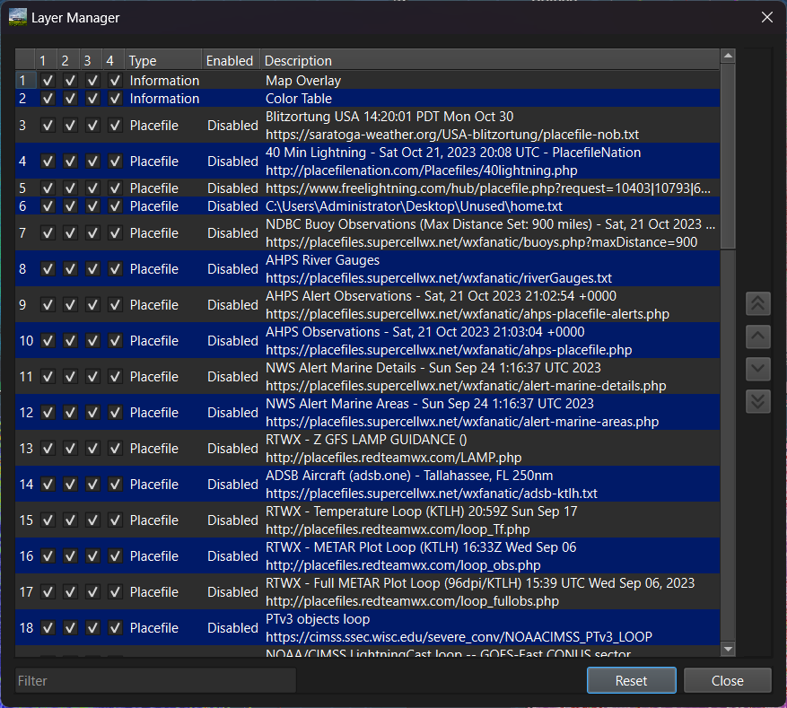
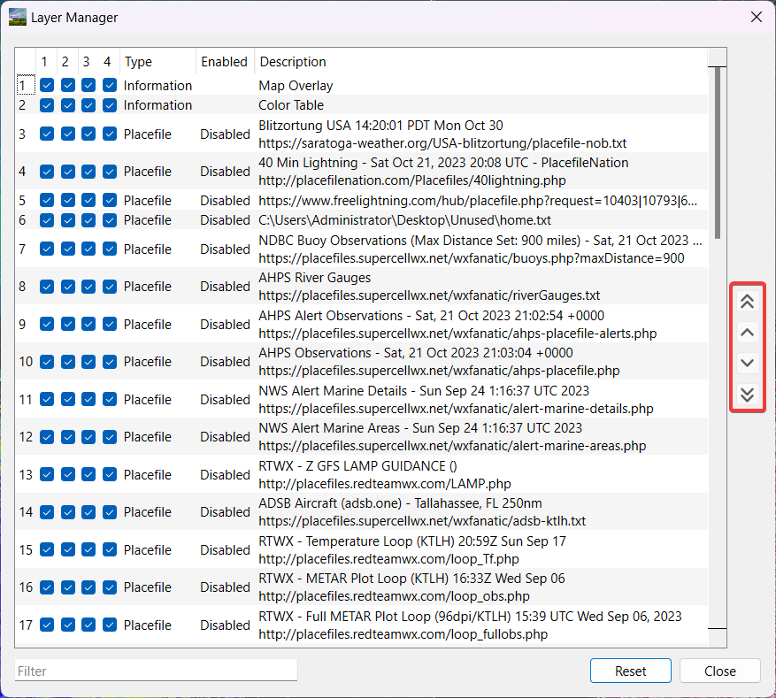
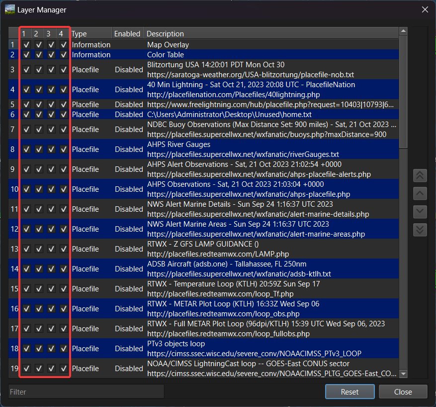
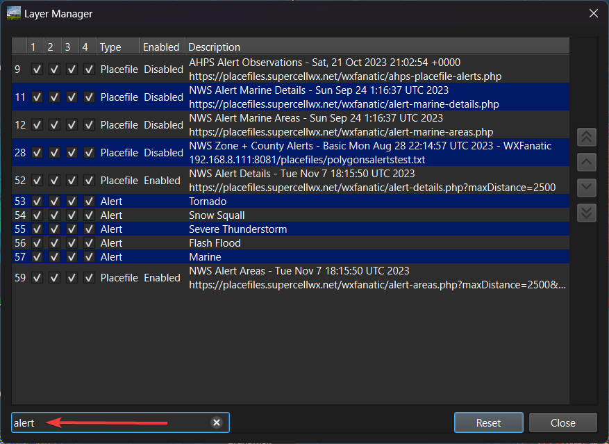
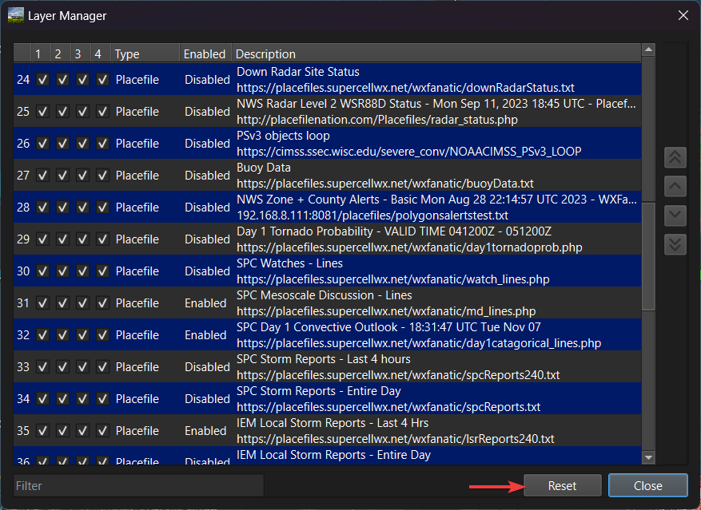

Layer Manager
=============

The Layer manager can be accessed from the menu by selecting **Tools > Layer Manager**. The layer manager will give the user flexibility to adjust the order in which items are displayed on the map.

Ordering layers
^^^^^^^^^^^^^^^

Layers are prioritized from the top to the bottom. Layers on the top will overlap any layers under them.

To readjust the order of a selected layer, the user will need to use the up and down arrows that are provided on the right. The single up and down arrow is used to move the selected layer one placement in either direction. The double up and down arrows are used to move the selected layer to the top or bottom of all the other layers displayed.

Hiding a layer from display
^^^^^^^^^^^^^^^^^^^^^^^^^^^

The layer manager will allow the user to hide a chosen layer from display. Depending upon how many grid panels the user has open (a total of 4), the user may hide the chosen layer using the checkboxes next to each layer. Checkboxes 1 & 2 would be the top two grid panels in a panel of 4, and 3 & 4 would be the bottom two panels.

.. note:: Unchecking a layer in the Layer Manager does not disable placefiles. If a user wishes to disable a placefile, they may do so in the placefile manager.

Filter
^^^^^^

Just like the Placefile Manager, the user may filter the list of layers. The user can filter the list by the name of the layer as well as the type of layer.

Reset
^^^^^

If the users wishes, they can reset all the layers by pressing the Reset button found on the bottom right of the Layer Manager.

Other mentions
^^^^^^^^^^^^^^

The Layer Manager gives the user not only the ability to hide placefiles, but also hide range rings, radar data, alerts, color table, and the map overlay from any of the 1-4 grid panels.

Some layers are not adjustable by design, such as the map overlay, color table, map symbology, and the map underlay.