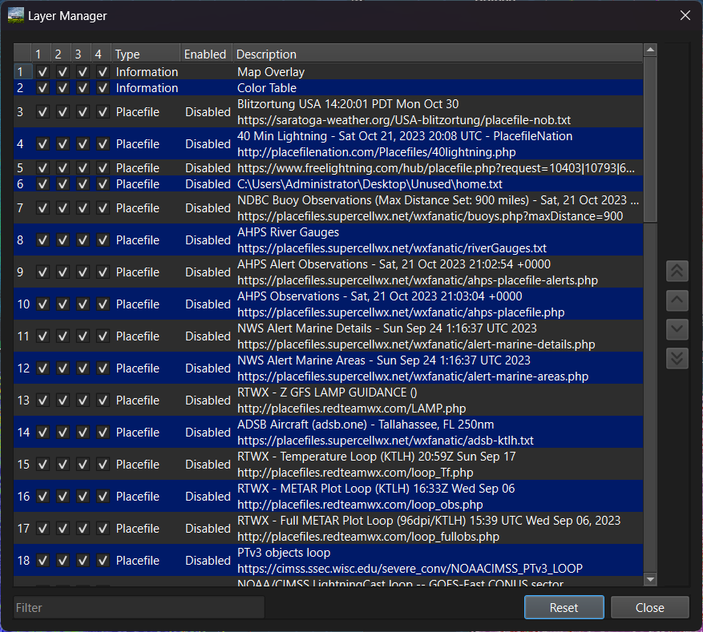
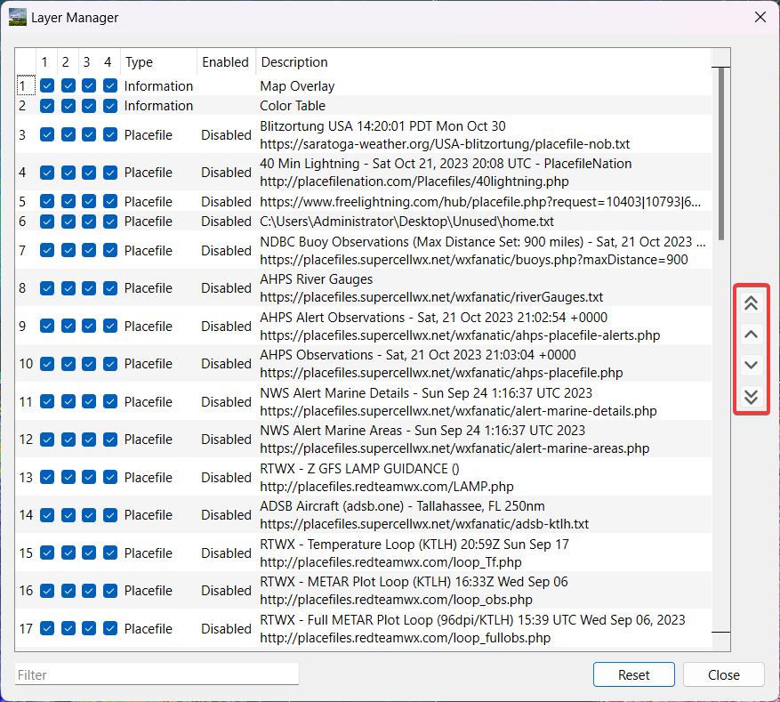
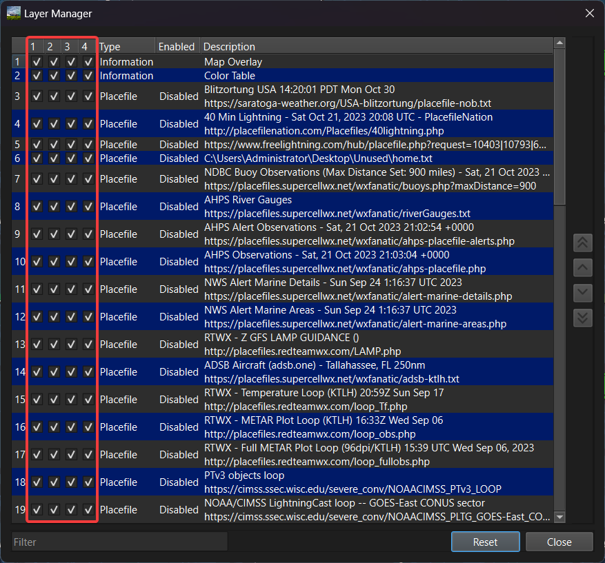
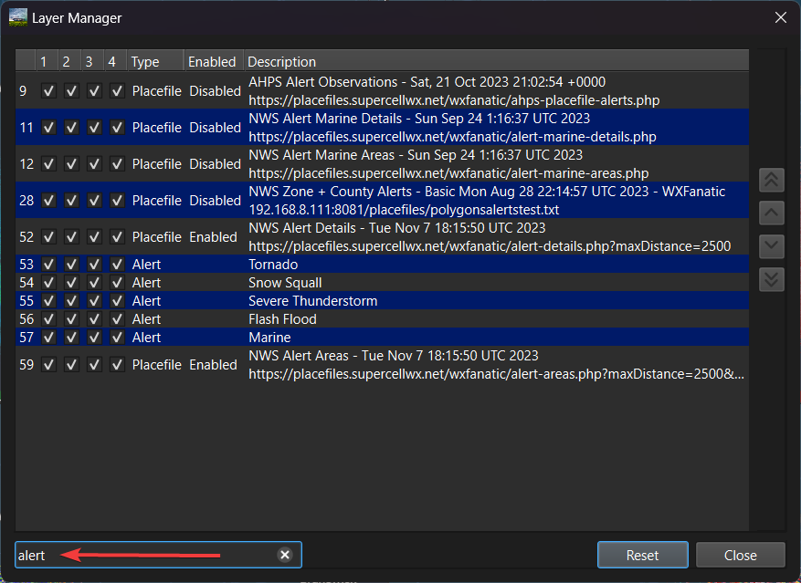
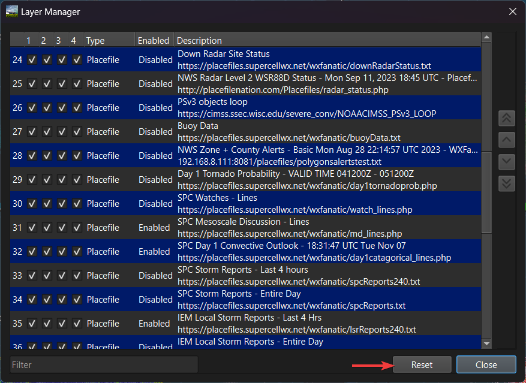
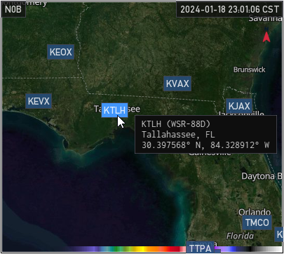

Layer Manager
=============

The Layer manager can be accessed from the menu by selecting **Tools > Layer
Manager**. The layer manager will give the user flexibility to adjust the order
in which items are displayed on the map.

Ordering layers
^^^^^^^^^^^^^^^

Layers are prioritized from the top to the bottom. Layers on the top will
overlap any layers under them.

To readjust the order of a selected layer(s), the user will need to use the up
and down arrows that are provided on the right. The single up and down arrow is
used to move the selected layer one placement in either direction. The double up
and down arrows are used to move the selected layer to the top or bottom of all
the other layers displayed. Alternatively, the user may drag and drop layers to
the desired position.

Hiding a layer from display
^^^^^^^^^^^^^^^^^^^^^^^^^^^

The Layer Manager will allow the user to hide a chosen layer from display.
Depending upon how many map panes are in the grid (up to nine, from **Grid
Width** and **Grid Height** in Settings), the user may hide the chosen layer
using the checkboxes next to each layer. Checkbox numbers match pane order in
the grid (left-to-right, top-to-bottom).

.. note:: Unchecking a layer in the Layer Manager does not disable placefiles.
          If a user wishes to disable a placefile, they may do so in the
          Placefile Manager.

Layer opacity
^^^^^^^^^^^^^

The **Opacity** column shows each layer's opacity as a percent. Map Underlay and
Map Symbology are labeled **Opaque** and cannot be faded.

To change opacity, select one or more overlay layers and use the **Opacity**
slider or percent field at the bottom of the dialog. 100% is fully opaque; 0%
hides the layer visually while leaving it enabled.

Opacity applies to radar products, alerts, placefiles, location markers, radar
range, overlay products, the color table, map overlay text, and radar sites.
Radar product opacity can also be adjusted from **Radar Opacity** in the Radar
Toolbox **Map Settings** (see :doc:`radar-toolbox`); both controls edit the same
Radar layer setting.

Filter
^^^^^^

Just like the Placefile Manager, the user may filter the list of layers. The
user can filter the list by the name of the layer as well as the type of layer.

Reset
^^^^^

If the users wishes, they can reset all the layers by pressing the Reset button
found on the bottom right of the Layer Manager.

Other mentions
^^^^^^^^^^^^^^

The Layer Manager gives the user not only the ability to hide placefiles, but
also hide Range Rings, Radar Data, Alerts, Color Table, and the Map Overlay from
individual grid panes.

Some layers cannot be reordered, including Map Overlay, Color Table, Radar
Sites, Map Symbology, and Map Underlay. Map style layers (Map Underlay and Map
Symbology) also cannot have their opacity changed.

Shortcut
^^^^^^^^

Select layers are available to display or hide from the **View > Map Layers**
menu as a quick shortcut for commonly-toggled layers. Selecting a layer from
this menu will display or hide the layer from all maps in the grid.

Layer Descriptions
^^^^^^^^^^^^^^^^^^

Radar Sites
"""""""""""

This layer allows Radar Site selection from the map.

Shortcut: **View > Map Layers > Radar Sites**

