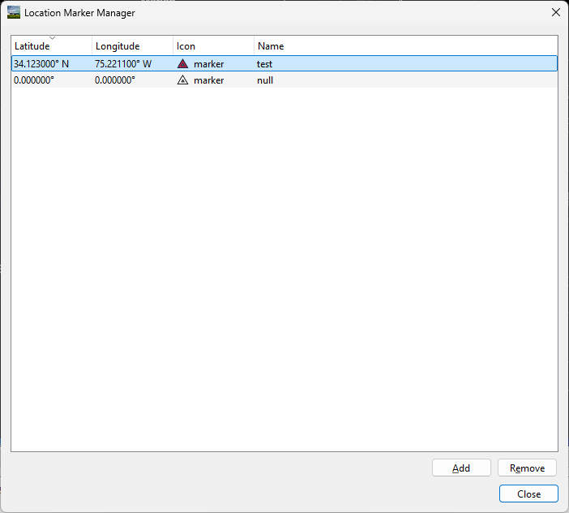
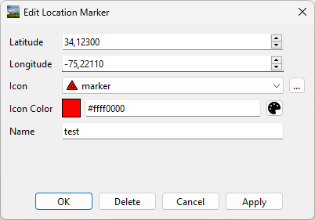

Location Marker Manager
=======================

The Location Marker manager can be accessed from the menu by selecting **Tools
> Location Marker Manager**. It allows for the management of location markers'
positions, icons, and names.

Adding a location marker
^^^^^^^^^^^^^^^^^^^^^^^^

The user can add a location marker by clicking on the Add button in the
location marker manager or by using the Add Location Marker hotkey while on the
map (the default is M). The Add button requires the manual input of a latitude
and longitude, whereas the hotkey will place the marker at the location of the
mouse on the map. Both methods will show the
:ref:`edit-location-marker-dialog`. When adding a new location marker,
canceling the dialog will delete the location marker.

Editing a location marker
^^^^^^^^^^^^^^^^^^^^^^^^^

A location marker can be edited by either right clicking it on the map, or
double clicking it in the Location Marker Manager. Either will open the
:ref:`edit-location-marker-dialog`. When editing, canceling the dialog will not
apply any changes to the location marker.

Removing a location marker
^^^^^^^^^^^^^^^^^^^^^^^^^^

A location marker can be removed by either selecting it in the Location Marker
manager and pressing Remove or by pressing Delete in the
:ref:`edit-location-marker-dialog`.

.. _edit-location-marker-dialog:

Edit Location Marker Dialog
^^^^^^^^^^^^^^^^^^^^^^^^^^^

The Edit Location Marker dialog allows for editing the location, icon, and name
of a location marker. The latitude and longitude of the marker are in degrees.

A custom image can be used as the location marker icon. Select a custom image
using the button with three dots to the right of the Icon combo box. PNG and
SVG are the only supported file formats. The size of the icon on the map is
determined by the size of the image. Once there is a marker with the icon, the
icon will appear in the Icon combo box.

The color of the icon is in ARGB hexadecimal format (#aarrggbb). You can also
use the color picker next to it to select a color. For custom icons, it is
important to know that the colors of the icon are "modulated" by the color
field. This means that white will become the color, black will stay black, and
other colors will be shifted towards the color. Setting the color to white will
leave the icon unchanged. Specifically, the color values are multiplied
together and then normalized.

