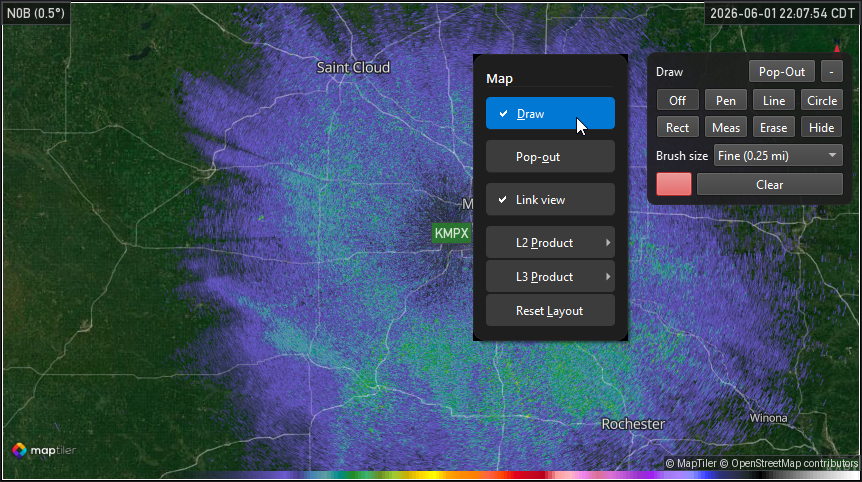
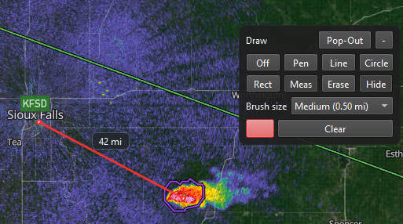

Map Drawing
===========

Supercell Wx can draw annotations directly on the map: freehand strokes, lines,
circles, rectangles, and distance measurements. Drawings are rendered on the map
for each map pane.

Opening the Draw Tools
----------------------

Open the **Draw** toolbar from the map pane context menu (right-click the map and
choose **Draw**). The toolbar docks on the map edge; use **Pop-Out** on the
toolbar header to float it, or **-** to hide it.

   Expanded **Draw** panel showing tool buttons, brush size, color, and
   **Clear**.

Tools
-----

.. list-table::
   :header-rows: 1
   :widths: 20 80

   * - Tool
     - Description
   * - Off
     - Disables the active draw tool. Map pan and zoom behave normally.
   * - Pen
     - Freehand drawing on the map.
   * - Line
     - Straight line between two points.
   * - Circle
     - Circle from center and radius.
   * - Rect
     - Axis-aligned rectangle from two corners.
   * - Meas
     - Distance measurement between points. Each endpoint is an anchor that can
       be dragged to adjust the measurement.
   * - Erase
     - Remove annotations by clicking or dragging over them.

**Hide** / **Show** toggles visibility of all drawings on the active map without
deleting them. **Clear** removes every annotation on that map pane.

Style
-----

- **Brush size** — Choose a preset width or **Custom** and use the slider.
- **Color** — Opens a color picker for stroke color.
- **Fill shape** — When enabled, filled circles and rectangles use the selected
  color.

Map Interaction
---------------

When a draw tool other than **Off** is selected:

- Use the active tool with the left mouse button on the map.
- Hold **Ctrl** and left-click drag to pan the map without switching tools.
- Right-click drag still rotates the map (see :doc:`../getting-started/initial-setup`).

   **Meas** tool showing a line and distance label between two points.

Context Menu
------------

The map pane context menu includes **Draw** with a check mark when the toolbar is
open on that pane. Opening **Draw** on another pane switches the toolbar to that
map.

Persistence
-----------

Draw tool state (selected tool, brush, color, visibility, and panel layout) is
saved per session. Annotations belong to the map pane where they were created.
