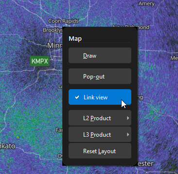
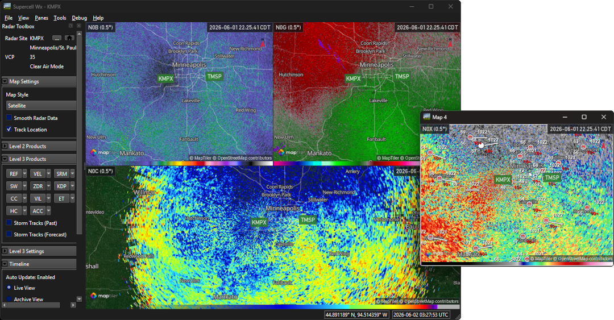

Multi-Pane Map Layout
=====================

Supercell Wx can show up to nine map panes (grid width and height of 1–3 each in
**File > Settings**). Beyond the grid settings in :doc:`settings`, each pane has
its own radar site, products, and map view. Panes can be linked, popped out into
separate windows, and restored when you restart the application.

Link View
---------

Each map pane has a **Link view** option in the right-click context menu.

When **Link view** is on for a pane:

- Radar site changes on that pane are mirrored to other panes that also have
  **Link view** enabled.
- Map pan and zoom stay synchronized with the linked group.

When **Link view** is off, that pane keeps its own site and view. Turning
**Link view** back on snaps the pane's radar site to match the reference linked
pane.

   Context menu on a map pane with **Link view** checked and **Pop-out**
   visible.

.. tip::

   Use **Link view** when comparing the same storm across products or tilts in
   split panes. Turn it off on a pane you want to explore independently.

Pop-Out and Dock
----------------

**Pop-out** (context menu) moves a grid pane into its own floating window. The
main window keeps the remaining grid layout; the popped pane keeps its radar
data and annotations.

To return a pane to the grid:

- Right-click the map in the pop-out window and choose **Dock**, or
- Close the pop-out window (same as **Dock**).

   Main window with a multi-pane grid and one **Pop-out** map window showing the
   same or linked content.

Layout Persistence
------------------

Splitter sizes between panes and each pane's **Link view** state are saved when
you change them and restored on the next launch. Grid width and height are stored
in **Settings** as before.

Resetting Layout
----------------

Use **Panes > Reset Map Layout** (or the equivalent action in the map context
menu when a pane is popped out) to rebuild the grid from current **Grid Width**
and **Grid Height** settings, and reset selected products to default. This does
not change saved link flags, but recreates pane widgets from the configured grid
dimensions.

Map Controls
------------

Right-click drag to rotate the map only begins after the pointer moves farther
than the system double-click distance. A stationary right-click does not nudge
the map bearing.

Level 2 and Level 3 product submenus in the map context menu share the same
styling as the root menu. Elevation selection for Level 2 products is only in
the **Level 2 Settings** section of the Radar Toolbox, not in the context menu.
