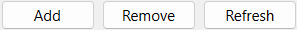
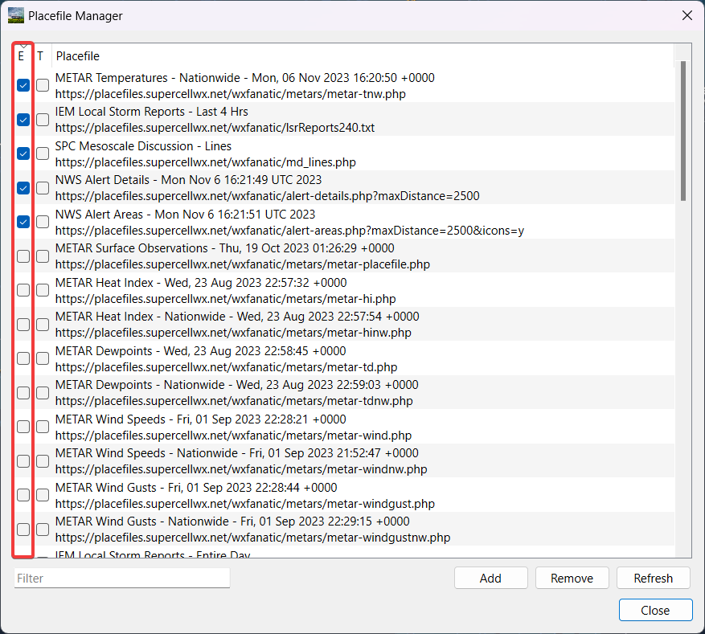
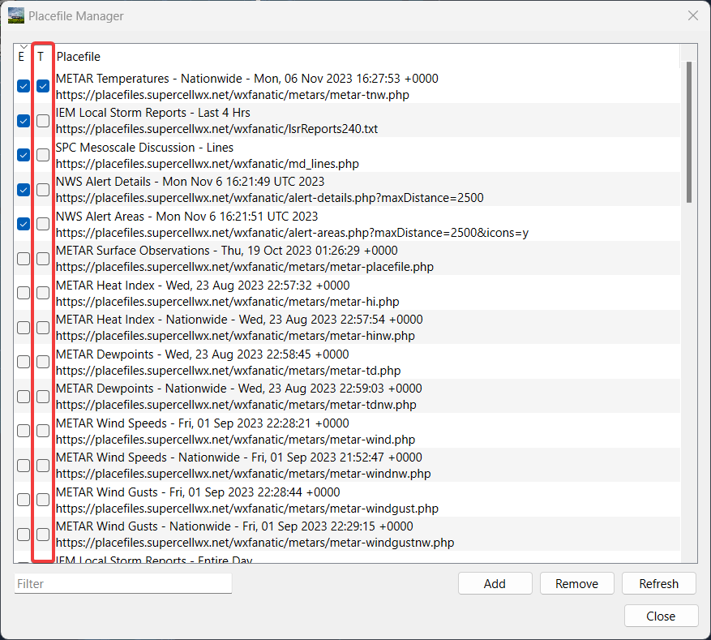
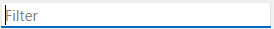
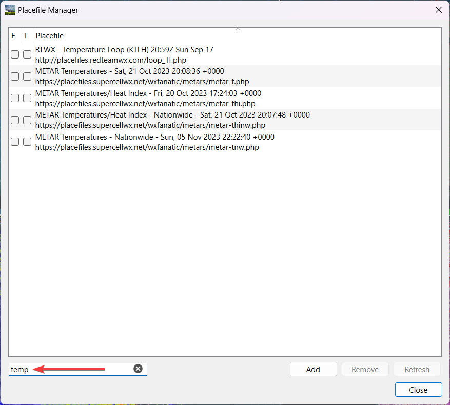

Placefile Manager
=============

The placefile manager can be accessed from the menu by selecting **Tools > Placefile Manager**. Placefiles give the user flexibility when deciding to add additional features not included by default. 

After opening the placefile manager, the user is presented with the ability to add, remove or refresh placefiles.

Adding a placefile
^^^^^^^^^^^^^^^^^^

To add a placefile, the user will need to hit the Add button, and then the user is given the option to add a link to a specific placefile that is hosted online or add a locally made placefile using the button that has 3 dots.

Enabling or disabling a placefile
^^^^^^^^^^^^^^^^^^^^^^^^^^^^^^^^^

To enable or disable a placefile, the user would check or uncheck the box next to the placefile under the E column. The user may also sort by all enabled placefiles in the list by clicking the E.

Thresholds
^^^^^^^^^^

Thresholds give the user the ability to hide placefiles when at a zoom level which is set by the placefile. 

.. note:: This is fully dependant upon the placefile itself, and cannot be changed by the user.

To enable a threshold, the user will check the box next to the placefile under the T column. The user may also sort by all enabled thresholds in the list by clicking the T.

Filter
^^^^^^

The user may filter the list of placefiles. The user can filter the list by the name of the placefile or by the link of the placefile. One reason a user may want to do this is if the user's placefile list becomes too big to search through and they're looking to search for specific placefiles.

Example:

Additional Tips
^^^^^^^^^^^^^^^

The user may change the link to a placefile they have already added by double clicking the field of the placefile.

Placefile Resources
^^^^^^^^^^^^^^^^^^^

When looking for placefiles to add, there are several options available to the user that are both free and paid. Here are several resources for placefiles that are available to the user. 

.. note:: Supercell-Wx is not responsible for anything that happens with the placefile suggestions below and that the user assumes all risk, however Supercell-Wx will give support when it comes to incompatibility, within reason.

Free:
1. Supercell-Wx hosted: https://placefiles.supercellwx.net/
2. Saratoga-Weather: https://saratoga-weather.org/grlevelx-placefiles.php
3. RedTeamWX: http://www.redteamwx.com/grlevelx.html
4. PlacefileNation: http://placefilenation.com/#placefiles
5. Iowa State University: https://mesonet.agron.iastate.edu/request/grx/
6. University of Wisconsin: https://cimss.ssec.wisc.edu/severe_conv/training/training.html
7. WXJoe: http://gr.wxjoe.com/
8. FreeLightning: https://www.freelightning.com/
9. A collection of various placefiles: https://luker.org/resources/grlevelx/placefiles/

Paid:
1. AllisonHouse: https://www.allisonhouse.com/
2. Josh3D: http://www.josh3d.com/weather/plan/placefiles.php