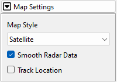
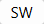
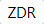
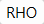
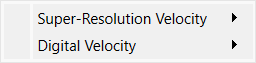
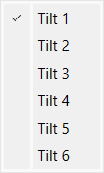
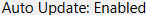
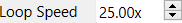
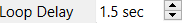

Radar Toolbox
=============

The Radar Toolbox is used to control the map grid that displays the various
weather products.

Radar Info
----------

Radar Site
^^^^^^^^^^

The Radar Site section shows the currently active radar site for the selected
map, along with the site's location.

.. image:: images/radar-toolbox-01-radar-site.png

Pressing the **Site Selection** button to the right displays the Select Radar Site
dialog.

.. image:: images/radar-toolbox-01-radar-site-dialog.png

Radar Sites can be sorted or filtered by various parameters, including Site ID,
location, type, and distance from the current location. Clicking the far-right
column to add or remove a star icon will toggle the site as a preset.
Double-clicking a site or pressing OK will pan the map and load radar data for
the new site.

.. note:: If the new site does not have the same radar products available as the
          previously selected site, an alternate radar product may need to be
          selected before updated data will display. This is especially the case
          when switching between WSR-88D and TDWR sites.

Pressing the **Home** button will change the active radar site to the default
defined in settings.

If radar site presets have been configured, the **Presets** button will display.
Pressing the **Presets** button will provide a dropdown menu with selected
presets.

VCP
^^^

VCP is the Volume Coverage Pattern. The VCP defines how the radar scans the
atmosphere, including what elevation tilts are scanned and the rotation speed of
the radar. This section will also display the operating mode defined by the VCP:
"Clear Air Mode" or "Precipitation Mode".

For more information about VCPs, visit https://www.noaa.gov/jetstream/vcp_max.

Map Settings
------------

Map Style
^^^^^^^^^

The Map Style dropdown will display a list of the available map styles for the
selected map provider (e.g., Mapbox or MapTiler). Selecting a style will update
the active map. For details on the available map types, see the selected map
provider's website:

- Mapbox: https://www.mapbox.com/gallery/
- MapTiler: https://cloud.maptiler.com/maps/ (requires login)

.. note:: Not all map styles visible on the map provider's website are available
          within Supercell Wx, as new map styles are added on a regular basis.

Shortcut: ``s`` or both mouse buttons

Track Location
^^^^^^^^^^^^^^

The **Track Location** checkbox will query the operating system for the current
location. The current location will appear as a crosshair icon on the map:

Radar Products
--------------

Level 2
^^^^^^^

.. image:: images/radar-toolbox-02-level2-products.png

Reflectivity
""""""""""""

.. image:: images/radar-toolbox-02-level2-ref.png

Level 2 Reflectivity (REF) is raw radar data that provides measurements of the
intensity of reflected radar signals from precipitation targets, such as
raindrops or snowflakes. This is commonly used to visualize the intensity of
precipitation. Also note that this data is generally used for a more in-depth
examination in comparison to Level 3 data.

Velocity
""""""""

.. image:: images/radar-toolbox-02-level2-vel.png

Level 2 Velocity (VEL) is raw radar data that provides measurements related to
the motion of precipitation targets. It specifically focuses on the velocity or
speed at which the precipitation targets are moving towards or away from the
radar system. This is commonly used to identify areas of rotation, wind
patterns, and the presence of severe weather phenomena like tornadoes or strong
winds and derechos.

Spectrum Width
""""""""""""""

Level 2 Spectrum Width (SW) is raw radar data that represents the variation or
dispersion in the Doppler velocities of precipitation targets within a radar
beam. High values of spectrum width generally suggest the presence of turbulent
atmospheric conditions, such as strong updrafts and downdrafts.

Differential Reflectivity
"""""""""""""""""""""""""

Level 2 Differential Reflectivity (ZDR) is raw radar data that measures the
differences in the intensity of the returned radar signals between horizontal
and vertical polarizations. It provides information about the shape and
characteristics of the precipitation targets, such as raindrops, snowflakes, or
hail. Positive values of ZDR indicate oblong or horizontally elongated targets,
like raindrops or melting snowflakes, while negative values suggest spherical or
vertically elongated targets, like hail or ice crystals. 

Differential Phase
""""""""""""""""""

.. image:: images/radar-toolbox-02-level2-phi.png

Level 2 Differential Phase (PHI) is raw radar data that measures the phase
difference between the horizontally and vertically polarized radar signals. PHI
helps in identifying phenomena like melting layers, supercooled liquid droplets,
and distinguishing between different types of precipitation particles.

Correlation Coefficient
"""""""""""""""""""""""

Level 2 Correlation Coefficient (RHO) is raw radar data that measures the
similarity or correlation between the horizontally and vertically polarized
radar signals. When RHO values are high, objects within the atmosphere have a
stronger correlation, they are similar in size like raindrops. When the RHO
values drop, different objects differ in size, and is likely indicative of
debris. This helps in identifying if there's debris from strong areas of
rotation indicated from VEL data.

Clutter Filter Power Removed
""""""""""""""""""""""""""""

.. image:: images/radar-toolbox-02-level2-cfp.png

Level 2 Clutter Filter Power Removed (CFP) is raw radar data that quantifies the
amount of power or signal that has been removed by the clutter filtering
algorithm. Clutter refers to unwanted radar echoes caused by non-meteorological
objects such as buildings, trees, or ground features. The clutter filtering
algorithm is designed to reduce the impact of these unwanted signals, allowing
for a clearer representation of the meteorological targets, such as
precipitation. A higher CFP value indicates a higher amount of clutter power
successfully eliminated by the clutter filtering process.

Level 2 Elevation
"""""""""""""""""

.. image:: images/radar-toolbox-03-level2-product-elevation.png

The elevation buttons allow the user to specify a particular elevation angle of
interest for data retrieval or display. Elevation angles are measured in degrees
and represent the vertical tilt of the radar beam relative to the horizontal
plane. Different elevation angles provide information about different layers of
the atmosphere. Each Level 2 product in Supercell Wx will give you this ability.

For more information about elevation, visit https://www.noaa.gov/jetstream/vcp_max.

Level 3
^^^^^^^^^

.. image:: images/radar-toolbox-04-level3-products.png

Reflectivity
""""""""""""

.. image:: images/radar-toolbox-04-level3-ref.png

Reflectivity Data Selection:

.. image:: images/radar-toolbox-04-level3-dataselref.png

Level 3 Reflectivity (REF) is processed radar data that has been aggregated and
averaged over larger spatial areas and time periods. This is commonly used to
visualize the intensity of precipitation, and is used more-so for weather
monitoring purposes. You can view Level 3 Reflectivity as Super-Resolution Data
or as the standard Digital Reflectivity data.

Velocity
""""""""

Velocity Data Selection:

Level 3 Velocity (VEL) is radar data that aggregates and averages the velocity
measurements obtained from Level 2 radar data over larger areas and time periods
to create a simplified representation of motion patterns. You can view Level 3
Velocity as Super-Resolution Data or as the standard Digital Velocity data.

Tilt Selection
""""""""""""""

Timeline
--------

.. image:: images/radar-toolbox-05-timeline.png

Auto Update
^^^^^^^^^^^

The Auto Update status provides information about the status of your radar data,
indicating whether you are currently receiving the most recent updates or if the
feature has been disabled. Auto Update is active in two scenarios: when the
animation is playing in Live View or when you access the latest scan using the
end button (By default, you are always viewing the latest scan).

Enabled:

Disabled:

.. image:: images/radar-toolbox-05-timeline-updatedisabled.png

Live View
^^^^^^^^^

Live View enables you to observe real-time updates from the radar site you have
selected, ensuring you stay up to date with the latest information.

Archive View
^^^^^^^^^^^^

With Archive View, you have the ability to access historical radar data.

.. note:: Older Level 2 formats, circa 2008 and prior, are not currently
          supported.

Animation Controls
^^^^^^^^^^^^^^^^^^

``Loop Time``

.. image:: images/radar-toolbox-05-timeline-looptime.png

``Loop Speed``

``Loop Delay``

.. |anim-begin| image:: ../images/font-awesome-6/backward-step-solid.svg
   :height: 12px
   :width:  12px
.. |anim-step-back| image:: ../images/font-awesome-6/angle-left-solid.svg
   :height: 12px
   :width:  12px
.. |anim-play| image:: ../images/font-awesome-6/play-solid.svg
   :height: 12px
   :width:  12px
.. |anim-pause| image:: ../images/font-awesome-6/pause-solid.svg
   :height: 12px
   :width:  12px
.. |anim-step-next| image:: ../images/font-awesome-6/angle-right-solid.svg
   :height: 12px
   :width:  12px
.. |anim-end| image:: ../images/font-awesome-6/forward-step-solid.svg
   :height: 12px
   :width:  12px

|anim-begin|     : ``Begin``

|anim-step-back| : ``Step Back``

|anim-play|      : ``Play``

|anim-pause|     : ``Pause``

|anim-step-back| : ``Step Back``

|anim-step-next| : ``Step Next``

|anim-end|       : ``End``
