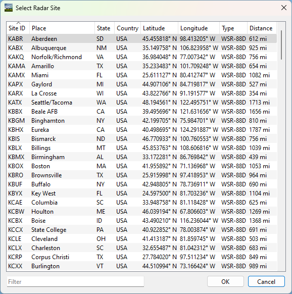
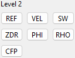
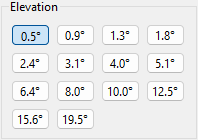
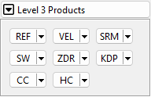
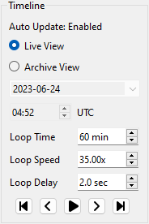

Radar Toolbox
=============

The Radar Toolbox is used to control the map grid that displays the various
weather products.

Radar Info
----------

Radar Site
^^^^^^^^^^

The Radar Site section shows the currently active radar site for the selected
map, along with the site's location. Pressing the site selection button to the
right displays the Select Radar Site dialog.

Radar Sites can be sorted or filtered by various parameters, including Site ID,
location, type, and distance from the current location. Double-clicking a site
or pressing OK will pan the map and load radar data for new site.

.. note:: If the new site does not have the same radar products available as the
          previously selected site, an alternate radar product may need to be
          selected before updated data will display. This is especially the case
          when switching between WSR-88D and TDWR sites.

VCP
^^^

VCP is the Volume Coverage Pattern. The VCP defines how the radar scans the
atmosphere, including what elevation tilts are scanned and the rotation speed of
the radar. This section will also display the operating mode defined by the VCP:
"Clear Air Mode" or "Precipitation Mode".

For more information about VCPs, visit https://www.noaa.gov/jetstream/vcp_max.

Map Settings
------------

Map Style
^^^^^^^^^

The Map Style dropdown will display a list of the available map styles for the
selected map provider (e.g., Mapbox or MapTiler). For details on the available
map types, see the selected map provider's website:

- Mapbox: https://www.mapbox.com/gallery/
- MapTiler: https://cloud.maptiler.com/maps/ (requires login)

.. note:: Not all map styles visible on the map provider's website are available
          within Supercell Wx, as new map styles are added on a regular basis.

Shortcut: ``s`` or both mouse buttons

Radar Products
--------------

Level 2
^^^^^^^

Reflectivity (REF) radar data refers to a specific type of weather radar information that provides detailed measurements of the intensity of reflected radar signals from precipitation targets, such as raindrops or snowflakes. This is commonly used to visualize the intensity of precipitation.
.. image:: images/l2buttons/radar-toolbox-02-level2-ref.png

Velocity (VEL) radar data is a type of weather radar information that provides measurements related to the motion of precipitation targets. It specifically focuses on the velocity or speed at which the precipitation targets are moving towards or away from the radar system. This is commonly used to identify areas of rotation, wind patterns, and the presence of severe weather phenomena like tornadoes or strong winds and derechos.
.. image:: images/l2buttons/radar-toolbox-02-level2-vel.png

Level 2 Product Settings
""""""""""""""""""""""""

Level 3
^^^^^^^

Timeline
--------

Auto Update
^^^^^^^^^^^

The Auto Update feature provides information about the status of your radar data, indicating whether you are currently receiving the most recent updates or if the feature has been disabled. Auto Update is active in two scenarios: when the animation is playing in Live View or when you access the latest scan using the end button (By default, you are always viewing the latest scan).

Live View
^^^^^^^^^

Live View enables you to observe real-time updates from the radar site you have selected, ensuring you stay up to date with the latest information.

Archive View
^^^^^^^^^^^^

With Archive View, you have the ability to access historical radar data. 

.. note::  Older Level 2 formats, circa 2008, are not currently supported.

Animation Controls
^^^^^^^^^^^^^^^^^^

``Loop Time``

``Loop Speed``

``Loop Delay``

.. |anim-begin| image:: ../images/font-awesome-6/backward-step-solid.svg
   :height: 12px
   :width:  12px
.. |anim-step-back| image:: ../images/font-awesome-6/angle-left-solid.svg
   :height: 12px
   :width:  12px
.. |anim-play| image:: ../images/font-awesome-6/play-solid.svg
   :height: 12px
   :width:  12px
.. |anim-pause| image:: ../images/font-awesome-6/pause-solid.svg
   :height: 12px
   :width:  12px
.. |anim-step-next| image:: ../images/font-awesome-6/angle-right-solid.svg
   :height: 12px
   :width:  12px
.. |anim-end| image:: ../images/font-awesome-6/forward-step-solid.svg
   :height: 12px
   :width:  12px

|anim-begin|     : ``Begin``

|anim-step-back| : ``Step Back``

|anim-play|      : ``Play``

|anim-pause|     : ``Pause``

|anim-step-back| : ``Step Back``

|anim-step-next| : ``Step Next``

|anim-end|       : ``End``
