Settings
========

Settings can be accessed from the menu by selecting **File > Settings**. The
**Settings** menu contains four categories: General, Palettes, Audio, and Text.

Settings can be globally restored to default with the **Restore Defaults**
button in the lower left corner.

Individual settings can be restored to their default with the circle arrow
button beside the respective setting.

.. note:: Most settings will require reloading the application to take effect.

General
-------

Clock Format
^^^^^^^^^^^^

Toggle between a 12-hour and 24-hour clock display.

Default Alert Action
^^^^^^^^^^^^^^^^^^^^
Changes what happens when selecting an alert in the Alerts panel.

- Go (Default) - Switch to issuing radar site and pan map to location.
- View - Open Alert to view text issued from NWS.

Default Radar Site
^^^^^^^^^^^^^^^^^^

Choose which radar site will load automatically upon opening the application.
The map will also be centered over the selected radar site.

Default Time Zone
^^^^^^^^^^^^^^^^^

Select between displaying the time zone of the selected radar, the user's local
time zone, or UTC.

Grid Width and Height
^^^^^^^^^^^^^^^^^^^^^

These settings allow multiple radar products to be viewed simultaneously.
Changing  Grid Width will create panes side by side, while Grid Height will
create panes top and bottom. The maximum value for both is two.

*Layout with a Grid Width of 2 and a Grid Height of 1*

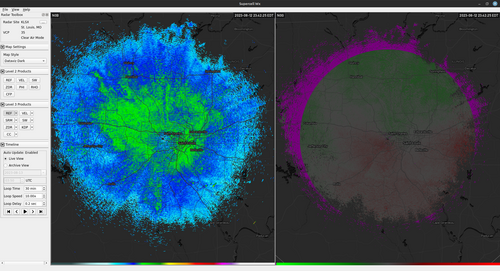

*Layout with a Grid Width of 1 and a Grid Height of 2*

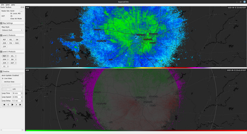

*Layout with a Grid Width of 2 and a Grid Height of 2*

.. image:: images/settings-general-03-gridwh-w2-h2-small.png

GPS Plugin
^^^^^^^^^^

Selected between the operating system default GPS provider and an external
device supporting the NMEA protocol. When selecting NMEA, either a serial source
or a network source should be selected. For the proper GPS baud rate, Supercell
Wx attempts to determine the correct value based on information supplied by the
operating system. Please consult your GPS manual for the proper value.

For selecting a network source, please see `Qt documentation
<https://doc.qt.io/qt-6/position-plugin-nmea.html#parameters>`_ for proper
format.

If using **gpsd** on Linux to serve GPS information to Supercell Wx, you will
need to use `gpspipe and socat <https://gpsd.gitlab.io/gpsd/gpspipe.html#_examples>`_
to serve NMEA data.

Map Provider
^^^^^^^^^^^^
Select the provider for the map underlays. Currently Mapbox and MapTiler are
supported. 

.. note:: The map types available on the Map Style dropdown in the Radar Toolbox
    will depend on the selected map provider. 

Mapbox API Key
^^^^^^^^^^^^^^
Input API key to be used when using Mapbox as the map provider.

MapTiler API Key
^^^^^^^^^^^^^^^^
Input API key to be used when using MapTiler as the map provider. The available
API keys can be found `on the account API Keys page
<https://cloud.maptiler.com/account/keys/>`_

Custom Map URL
^^^^^^^^^^^^^^
URL for a custom map style. This can be a map from either Mapbox Studio or
MapTiler Cloud.

A Mapbox map URL has the format: ``mapbox://styles/<username>/<id>``. This is
labeled as the **Style URL** in Mapbox Studio.

A MapTiler map URL typically has the format:
``https://api.maptiler.com/maps/<id>/style.json``. This is labeled as **Vector
Style** in MapTiler Cloud. Note the ``?key=...`` suffix must be removed from the
URL string.

When modifying a style, you may need to close Supercell Wx, delete the cache,
and re-open the application. On Windows, the cache is a ``.db`` file located at
``%LocalAppData%\Supercell Wx\`` or ``C:\Users\<username>\AppData\Local\Supercell Wx\``.
On Linux, the cache is located at ``~/.local/share/Supercell Wx/``.

.. note:: Custom Mapbox styles are supported up to Mapbox GL JS 1.10.0+. Later
    Mapbox SDK versions may have issues, as some newer features are not
    currently supported by `MapLibre <https://github.com/maplibre/maplibre-native>`_.

Custom Map Layer
^^^^^^^^^^^^^^^^
When using a custom map, Supercell Wx needs to know underneath which layer to
render the radar product and other items. When viewing the Layer Manager, the
layer name specified here (in regular expression format), and all higher
priority layers become the Map Symbology. Layers underneath this become the Map
Underlay.

Theme
^^^^^

**Default** will select the default Qt theme for the operating system being used.
For Windows, this is the *Windows Vista* style, and for Linux, this is the
*Fusion* style. This typically gives a native look-and-feel consistent with the
rest of the operating system.

**Fusion** will select the Fusion theme. On Linux, this is already the default.
On Windows, this will enable a Dark Mode if turned on in Windows settings.

Warnings Provider
^^^^^^^^^^^^^^^^^

Supercell Wx supports multiple warnings providers:

- https://warnings.cod.edu
- https://warnings.allisonhouse.com

Anti-Aliasing Enabled
^^^^^^^^^^^^^^^^^^^^^
Allows enabling and disabling of anti-aliasing on the map. Disabling can improve
performance, but may result in graphics with rougher edges. Changing this
setting requires restarting the application.

Show Map Attribution / Logo
^^^^^^^^^^^^^^^^^^^^^^^^^^^
If you have permission to hide map attribution, these selections allow you to do
so. At the time of writing, Mapbox does not advertise permission to hide
attribution. MapTiler allows hiding of the logo for paid subscriptions, but
still requires the attribution unless a special license has been granted.

- `Mapbox Attribution Guidelines <https://docs.mapbox.com/help/dive-deeper/attribution/>`_
- `MapTiler Attribution Guidelines <https://documentation.maptiler.com/hc/en-us/articles/4405445885457-How-to-add-MapTiler-attribution-to-a-map>`_

Show Map Center
^^^^^^^^^^^^^^^

Display an icon at the center of the map.

Update Notifications Enabled
^^^^^^^^^^^^^^^^^^^^^^^^^^^^

Notify the user of updates to Supercell Wx.

Debug Enabled
^^^^^^^^^^^^^

Enables the **Debug** options menu.

Palettes
--------

The map and radar display have multiple customization options, including color
tables. The default color tables come from `NOAA's Weather and Climate Toolkit
<https://www.ncdc.noaa.gov/wct/index.php>`_, but can be modified from the
**Palettes** category in the **Settings** dialog. Color tables are compatible
with the `GRLevelX <http://www.grlevelx.com/>`_ `Color Table File Specification
<http://www.grlevelx.com/manuals/color_tables/files_color_table.htm>`_.

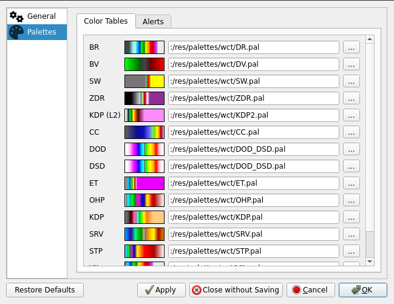

Additional color tables can be found at a number of sites, including:

- https://grlevelxusers.com/grlevelx-goodies/categories/color-tables/
- https://www.wxtools.org/

In addition to color tables, alert colors can also be modified. Use the text box
to specify a color in ARGB hexadecimal format (#aarrggbb), or use the color
picker to select a color.

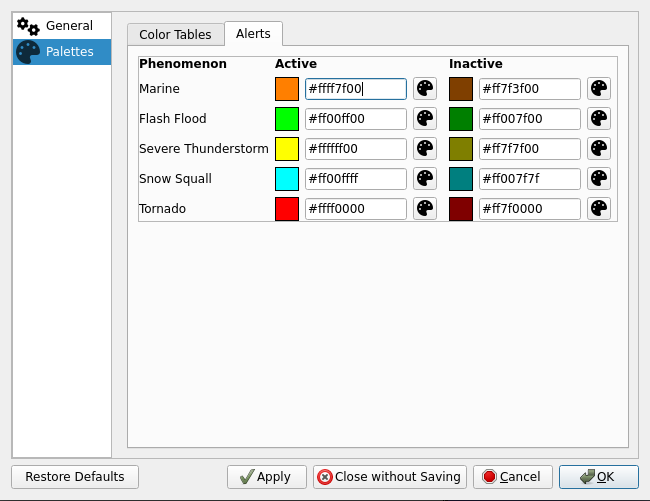

Audio
-----

Audio notifications can be selectively enabled for alerts from the **Audio**
tab.

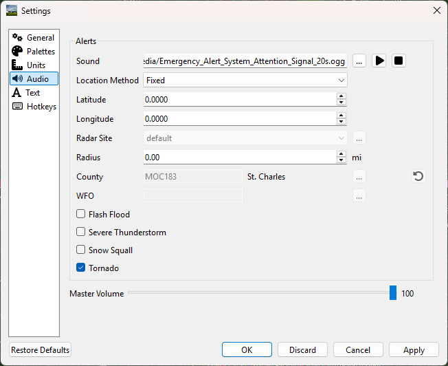

Sound
^^^^^

By default, the two-tone Attention Signal used by the Emergency Alert System is
played when a new or updated alert occurs for the selected location. An
alternate audio file can be selected and sampled using the buttons to the right
of the file path.

Location Method
^^^^^^^^^^^^^^^

Fixed
"""""

The **Fixed** location method will allow the user to manually enter a latitude and
longitude for alert audio notificatons.

Track
"""""

When using the **Track** location method, Supercell Wx will request location
information from the operating system. This may result in the operating system
notifying the user that Supercell Wx is using location information.

County
""""""

With the **County** location method, the user can select a county. Pressing the
adjacent tool button will open a county selection dialog.

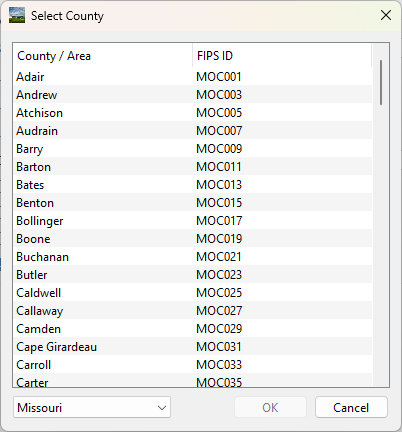

Text
----

Under the text menu, the user is given several different customization options
to adjust the font and style to the user's liking.

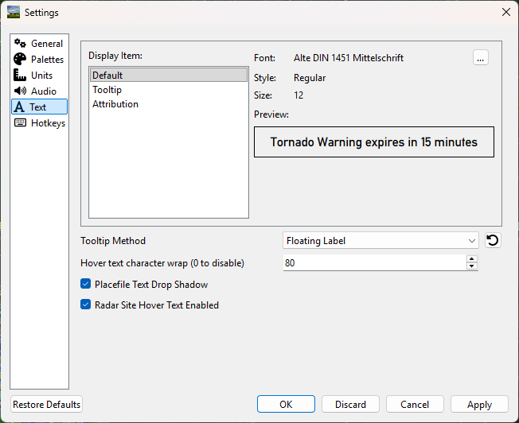

Choosing the font
^^^^^^^^^^^^^^^^^^

The user can select the font they'd like to use by choosing either the default
display item or the tooltip display item, and then hitting the 3 dots next to
the font name.

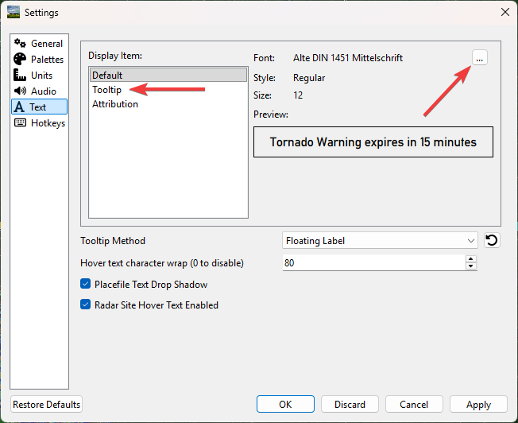

*Choose the font, font style, font size, effects and writing system*

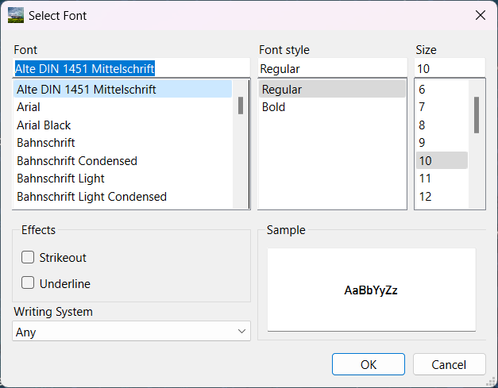

Tooltip method
^^^^^^^^^^^^^^

The tooltip method allows the user to change the method used for which pop-ups
are displayed. The user is also able to change the character wrap size if the
text from placefiles appear to be too long on the user's screen.

*Tooltip methods*

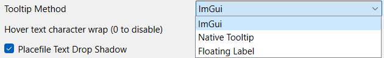

*Character wrap and placefile text drop shadow*

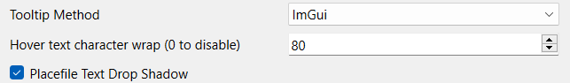

*Radar Site Hover Text Enabled*

Enables or disables a description of each radar site when hovered over.
